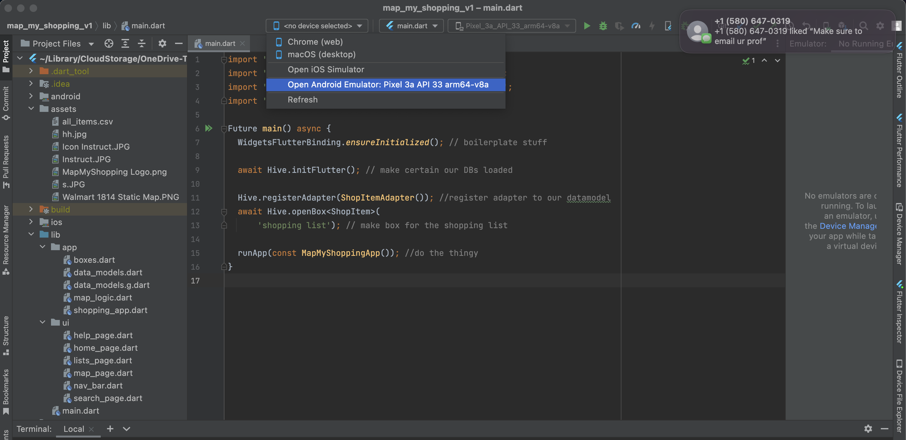

## Installation of Flutter
- Follow the instructions in [this tutorial](https://docs.flutter.dev/get-started/install)
- When you run "flutter doctor" int he terminal, don't be alarmed by the missing of Xcode. It is not required to run our application.
- The code to add Flutter to your github path is very important. For me personally, I had to put it in the terminal everytime I wanted to run the app.
- You can skip over the IOS simulator setup and follow the instruction for the Android simulator setup.
- Be careful with VM Accelerator it uses a lot of the computer's RAM (especially if coupled with chrome).

## Setting up your favorite editor.
- Follow the instructions in [this tutorial](https://docs.flutter.dev/get-started/editor)
- If it does not want to work in VS Code, you can fall back on android studio to run the application. It is the wish version of VS Code but good enough to run it.

## Starting the application
- Navigate to `flutter-final-01/map-my-shopping/`.
- **Important:** You may need to run `flutter pub get` on a terminal within our project to get the additional dependencies we used.
- Using your preferred code editor, navigate to `snot-a-problem-final-project/flutter-final-01/map-my-shopping/lib/main.dart.
- Select your chosen emulator/webview/attached device in the top bar as shown in the image here .
- Run `main.dart`. The application should launch in your chosen emulator/webview/attached device/etc.
- The app should hopefully be intuitive. For more detailed instructions about each page and running the app, refer to the file `"docs/Usage Instructions"`.