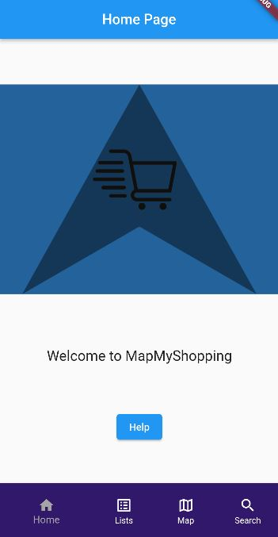
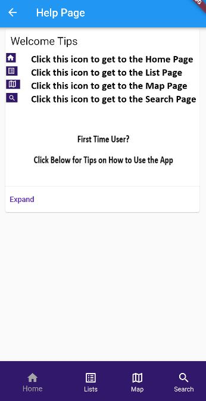
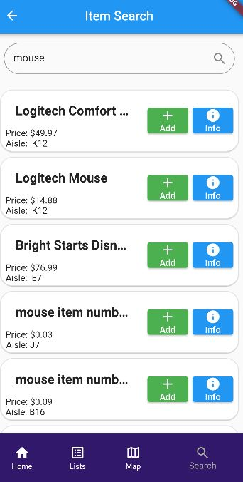
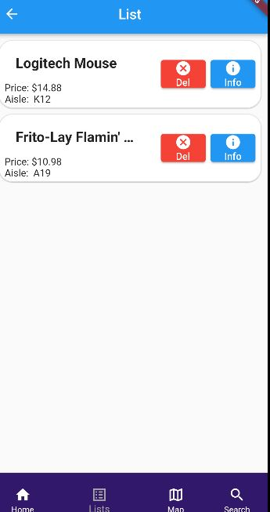
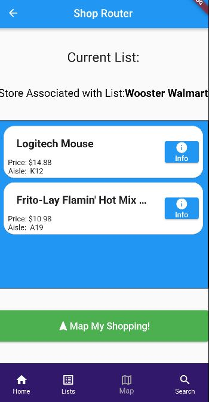
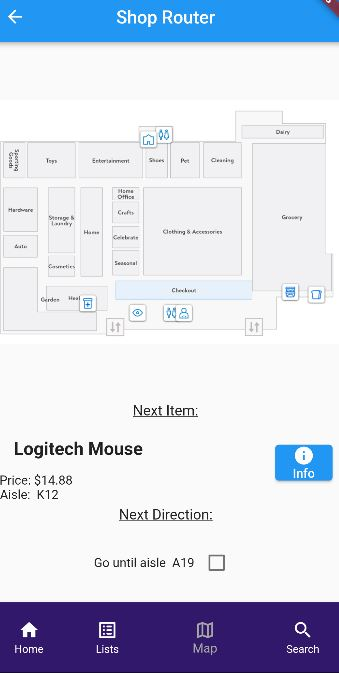

## Home Page
When the app is run the first page you will see is our home page. Our logo is in the center of the screen and a welcome message is displayed below it. On every screen on our app we have the navbar. Also on the home page is a button that says help. We will continue by clicking this button.

## Help Page
After clicking the help button you will now see the help page displayed. This page shows what page each icon points too. There is also a drop down menu that has tips for some frequently asked question. We get to these by clicking the expand button.

## Search Page
We will now click on the magnifying glass icon to get to the search page. On this page there is a search bar on top and some text on what to do on this page. We will search for a mouse to buy from the Wooster Walmart store. We click on the search bar and type in mouse. After hitting enter we now see our item in the search bar and all of the items displayed below. All the items displayed have a price and an aisle number. Each item also has two buttons one to add and one for info. The add button once clicked will add the item to the list. Clicking the info button will display the items name, description, price, aisle, and department information. From here we will add the Logitech Mouse item to our list. Now lets look up food in the search bar. We will also add the Frito-Lay Flamin' Hot Mix Variety Pack to the list as well for some variation. 

## List Page
After clicking add we can now click on the lists icon on the navbar. When entering the list page we now see the two items that we added. Each item is still displayed with the item name, price, and aisle number in the list. Each item once again has two buttons, a delete button and the info button. The info button will display all the same information as it did on the search page. The delete button will remove an item from the list. 

## Map Page
Now we can click on the map icon on the navbar. On the map page we see a header that says "Current List:" and a sub-header that says "Store Associate with List: Wooster Walmart". The sub-header would theoritically change if this app was designed for a larger scale of any store. Underneath the header and subheader we can see the items in our list displayed. Now they only have their info buttons and price and aisle numbers. The button below the list items reads "Map My Shopping" we can click this to get to the routing.

## Routing Page
After clicking the button below the list items we are now in the router. We see an image of the wooster walmart in the middle of the screen. Underneath we see a text that says "Next Item:" and below that is the first item in our list. Underneath is text that says "Next Direction:" and underneath has the text that says "Go until aisle " next to this text is where the aisle the user has to travel to next is located. Clicking the button next to the aisle will move us to the next item in our list. When the last item on your list is reached the next direction will say head towards checkout. After clicking the button again you will see a new button that says complete trip. Clicking the "complete trip" button will take you back to the homepage.
